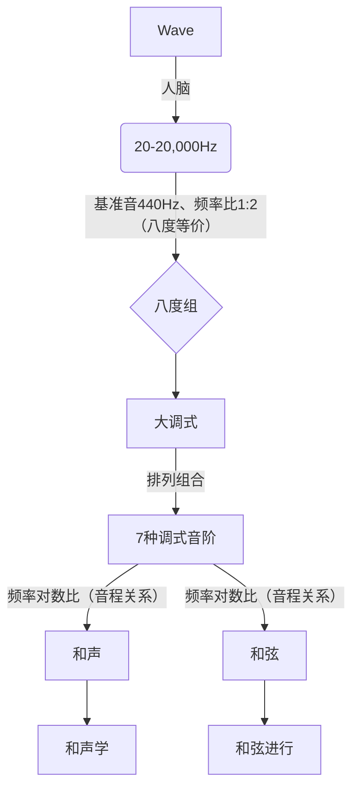

---
tags:
  - Label/ACG/MUSIC/MusicTheory
publish: false
---

## Fundamentals

# 西方音乐史（广义古典音乐）

[引言：古典音乐的基本常识 - 知乎](https://zhuanlan.zhihu.com/p/151157668)

[如何从头系统地听西方古典音乐？ - 知乎](https://www.zhihu.com/question/30957313/answer/1146473123)

## 国家

意大利
英国
法国
德国

## 古希腊古罗马（DC 7th - AD 476）

比较简单、原始。

## 中世纪（西罗马灭亡-文艺复兴开始）

宗教音乐
格里高利圣咏
复调音乐

## 文艺复兴（1430-1600）

声乐巨大发展
器乐相对以前发展
宗教音乐改革
世俗音乐发展

## 巴洛克（1600-1750）

器乐巨大发展，重要性超越声乐

巴赫

## 古典主义（1730-1815）

追求"艺术"

莫扎特
贝多芬

## 浪漫主义（1790-1910）

舒伯特
肖邦
柴科夫斯基
德彪西

### 民族主义

俄罗斯民族主义音乐
捷克民族主义音乐
匈牙利民族主义音乐
波兰民族主义音乐
挪威民族主义音乐
芬兰民族主义音乐

## 20世纪音乐
