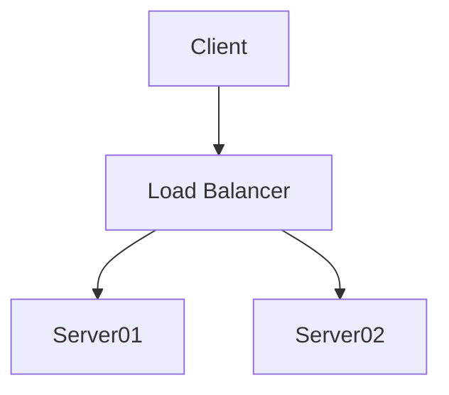

---
tags:
  - Label/Industry-工业科学/IT/APP/GUI/Desktop
  - flag/APP/Text
  - flag/License/Freeware
  - Label/Industry-工业科学/IT/APP/GUI/Mobile
npm: obsidian
frontmatter:
  - tags
  - aliases
  - cssclasses
frontmatter-types:
  - string
  - number
  - boolean
  - date
  - time
  - list
  - link
homepage: https://obsidian.md
md-callouts:
  - "!abstract"
  - "!attention"
  - "!bug"
  - "!cite"
  - "!caution"
  - "!danger"
  - "!error"
  - "!example"
  - "!failure"
  - "!fail"
  - "!faq"
  - "!help"
  - "!hint"
  - "!important"
  - "!info"
  - "!missing"
  - "!note"
  - "!question"
  - "!quote"
  - "!summary"
  - "!tldr"
  - "!todo"
  - "!tip"
  - "!warning"
html-elements:
  - "*"
extensions:
  - .md
  - .pdf
  - .avif
  - .bmp
  - .gif
  - .jpeg
  - .jpg
  - .png
  - .svg
  - .webp
  - .flac
  - .m4a
  - .mp3
  - .ogg
  - .wav
  - .webm
  - .3gp
  - .mkv
  - .mov
  - .mp4
  - .ogv
files:
  - .obsidian/
protocol-scheme:
  - obsidian
---

## Community

[Obsidian](https://obsidian.md/)

- [ ] [Obsidian Help](https://help.obsidian.md/Obsidian/Index)

- [ ] [Obsidian 中文论坛](https://forum-zh.obsidian.md/)

- [ ] [Obsidian Forum](https://forum.obsidian.md/)

- [ ] [obsidian的信息源（MOC） - Obsidian中文教程 - Obsidian Publish](https://publish.obsidian.md/chinesehelp/07+%E4%BF%A1%E6%81%AF%E6%BA%90%E4%B8%8E%E8%B4%A1%E7%8C%AE%E8%80%85/obsidian%E7%9A%84%E4%BF%A1%E6%81%AF%E6%BA%90%EF%BC%88MOC%EF%BC%89)

- [ ] [Shadow Walker 松烟阁](https://www.edony.ink/)

- [ ] [二一的笔记-硬核测评笔记软件与效率工具](https://eryinote.com/)

[Obsidian 高质量非官方中文教程 - Obsidian Publish](https://publish.obsidian.md/chinesehelp/01+2021%E6%96%B0%E6%95%99%E7%A8%8B/2021%E5%B9%B4%E6%96%B0%E6%95%99%E7%A8%8B)

[Obsidian 相关文章索引 - 知乎](https://zhuanlan.zhihu.com/p/369832125)


## Philosophy

[Obsidian philosophy - Obsidian Help](https://help.obsidian.md/Obsidian/Obsidian)

[卡片笔记之困与秩序的重建 - 少数派](https://sspai.com/post/68607)

[我的Obsidian入门之旅 | 二丫讲梵](https://wiki.eryajf.net/pages/6ed7fe/)

[有什么本地笔记管理软件推荐？ - 韦易笑的回答](https://www.zhihu.com/question/266836039/answer/2728791257)

[以ob为主的工作流（MOC） - Obsidian中文教程 - Obsidian Publish](https://publish.obsidian.md/chinesehelp/01+2021%E6%96%B0%E6%95%99%E7%A8%8B/%E4%BB%A5ob%E4%B8%BA%E4%B8%BB%E7%9A%84%E5%B7%A5%E4%BD%9C%E6%B5%81%EF%BC%88MOC%EF%BC%89)

[How Obsidian stores data - Obsidian Help](https://help.obsidian.md/Advanced+topics/How+Obsidian+stores+data)

[Tags - Obsidian Help](https://help.obsidian.md/Editing+and+formatting/Tags)

[Backlinks - Obsidian Help](https://help.obsidian.md/Plugins/Backlinks)

[Outgoing links - Obsidian Help](https://help.obsidian.md/Plugins/Outgoing+links)

[Create notes - Obsidian Help](https://help.obsidian.md/How+to/Create+notes)

[Link notes - Obsidian Help](https://help.obsidian.md/Getting+started/Link+notes)


- Relationship:
    - Directory/File/Heading
    - Tag
    - 链接

- Philosophy
    * MECE 多叉树
    * 主题文章
        - ~~理论上，或许有完美的 MECE 多叉树，但肯定不符合直觉，也不由雅。~~即便是理论上，也不可能存在完美的多叉树，因为一个节点必然能从不同角度进行分类，也就是说，MECE 多叉树必然会有内容一模一样、但位置不一样的 Node
        - 例如，我按照 MECE 原则，介绍了几款音乐播放器。现在，我又写了几篇实际测评「HTC U11+官改 の 音乐播放器音质排名」「HTC U11+RROS の 音乐播放器音质排名」。问题来了，按照 MECE，我的这几篇文章该怎么处理呢？
        - 第一，每篇文章直接作为多叉树的一个 Node（节点），与音乐播放器笔记 Node 在同一个层级（即兄弟节点）。
        - 这种做法有着逻辑错误。因为多个软件的横评与单个软件的指南，显然不是兄弟节点的关系。
        - 第二，既然不是兄弟节点，那后代节点的关系呢？
        - 很遗憾，「某个机器的」「多款音乐播放器」「横评」，你说该放到哪个子节点呢？
        - 「某台机器」の子节点？这样岂不是体现不出对其他机器的参考价值。
        - 「某个音乐播放器」の子节点？放哪个播放器下都不合适。放 A 播放器下，岂不是体现不出 B 播放器的存在。
        - 专门给多叉树开一个名为「横评」的独立分支？都独立了，怎么体现跟「具体机型」「具体播放器」的关联，而且，这明显违反 MECE 原则。
        - 综上，「直接」处理在理论上是行不通的。
        - 「直接」不行，只能「间接」了。
        - 「间接」是什么呢？
        - 按照 MECE 原则，「间接」就是，将「一篇文章」拆成「多个部分」，各部分放进正确的 Node。这需要重构文章内容与结构，以保证既能「不重不漏」，又能够体现 Node 之间的「关系」。
        - 理论上是这样的。但是，实践起来很困难。
        - 第一，效率太低。「重构」这个行为，凭空多出了很多「重复性的」工作量。
        - 第二，
        - 

- Description:
    * Obsidian 本质是支持超多方言的 Markdown 编辑器/渲染器
    * Obsidian 是一个支持超多 Markdown 方言、并且可以自定义 Markdown 方言（通过编写插件）的 Markdown 编辑器」。官方提供的一些 Core Plugins，本质是 Markdown 方言的 Renderer
    * Obsidian 基于 Markdown 的第二大脑
    * Obsidian == 只为 Markdown 而生的 [[VSCode|VSCode]]
    * Obsidian == 基于 Markdown 的个人 Wiki
    * Obsidian 支持五大主流平台
    * Obsidian 桌面端基于 Electron，但速度却不慢
    * Obsidian 闭源
    * Obsidian 个人免费，商用收费
    * Obsidian 永远不会使用私有存储格式，这是他们的哲学与初衷
    * Obsidian 基于 Markdown，完全可以和其他软件一起工作
    * Obsidian 开放性吊打 Notion
    * Obsidian 本身虽不开源，但是包括官方在内的整个社区及其生态都十分开放，官方完全不截留用户的数据，安安心心优化核心功能、开放插件 API；社区插件大多数都开源，而且整体质量非常高
    * Obsidian 支持 Markdown
    * Obsidian 支持 [[Mermaid]]
    * Obsidian 支持 [MathJax 数学公式](http://docs.mathjax.org/en/latest/basic/mathjax.html)
    * Obsidian 支持 [iframe 内嵌网页](https://developer.mozilla.org/en-US/docs/Web/HTML/Element/iframe)
    * Obsidian 支持 折叠缩进
    * Obsidian 支持 自定义插件，有着类似 VSCode 的插件市场
    * Obsidian 支持 导入 Notion
    * Obsidian 支持 导入 Notion (automated)
    * Obsidian 支持 导入 Evernote
    * Obsidian 支持 导入 OneNote
    * Obsidian 支持 导入 Apple Notes
    * Obsidian 支持 导入 Zkn3
    * Obsidian 支持 导入 TiddyWiki5
    * Obsidian 支持 内嵌多媒体文件，以链接的形式
    * Obsidian 的理念是 link 是一等公民
    * Obsidian 的理念是 以开放的纯文本格式存储数据，也是其初衷
    * Obsidian 的理念是 纯文本，而不是私有二进制格式
    * Obsidian 的理念是 网上很多文章、视频对 Obsidian 有所误解，把 Obsidian 看作是富文本，Obsidian 编写的全都是 Markdown 纯文本，无论界面有多么花里胡哨、可交互，那都是 Plugin 充当了 Renderer & Frontend 罢了，其中大部分都是通过 Markdown 原生链接语法来提供支持。如果没有理解这点，就无法理解 Obsidian 的开放性、扩展性、可迁移性
    * Obsidian 的理念是 Plugin 提供的扩展功能，主要是以 Markdown 链接的语法书写，这意味着，Markdown 之于 Plugin，类比 [[TeX|TeX]] 之于 LaTeX 包
    * 只要 Obsidian 能一直保持目前这种「通过向插件开放 API 来渲染 Markdown 方言」的扩展方式，那我就一直看好 Obsidian。惟有这样，才能真正积累来自社区的力量
    * Obsidian Sync 本质就是个 Dropbox/Mega
    * Obsidian Sync 免费提供 5 个 vault，每个 vault 最多 10 GB（包括历史记录），最大文件不超过 100 MB。容量还算良心，但仓库数量太少了，而且有安全风险，目测并不是零知识加密。我的评价是，不如自己搭建同步方案，这样才是真正自己掌控数据
    * Obsidian Publish 不能免费使用，贵，个人 $16/month
    * Internal Link 就是 Wiki 的内部引用
    * _Linked views_ are tabs that reference a different tab

- Glossary:
    - 不重不漏/MECE/树形/多叉树
        - 都是同一种思想
    - 文章/笔记/note
        - 默认指一个 Markdown 文件，除非特别说明


[这篇文章](https://sspai.com/post/68607) 思路跟我很像，结论也大同小异，都悟出了归根结底就只有三种工具，「分类」「标签」「引用」，并且不该 All in 任何一个。

他的结论是，三种都用，但以「外部链接」为主。

我的结论是，三种都用，但坚定地以「分类」为主。「引用」和「标签」只是为了补充「分类」的缺陷。

我比较偏向程序员风格，比较喜欢层次型模型、关系型模型，而不是网状模型（双向链接就是典型的网状模型）。开发者都知道，网状意味着复杂、不可控、脆弱。

我选择以「分类」为主，「引用」作为补充，就好像「图-关系型数据库」EdgeDB 的本质还是「关系型数据库」。EdgeDB 是 PostgreQL 的封装，只不过用类似图的语法来调用罢了。我把「引用」用作「分类」的封装，只不过用「双向链接」的语法来实现罢了。


[[VNote|VNote]] 2.8.2 终于找到更好的替代品了。

其实哲学层面并没有变化，只不过是工作流变了，变得优雅了。

由于 [[VNote|VNote]] 功能不够强大，准确的说是通用 Markdown 语法不够完备，我的笔记实践长期没有达到我的思想高度，根本没资格称为第二大脑。知道近几个月，受到 Google Style Docstring 的启发，再结合了 Dynalist Markdown reStructurerText MECE LTF 等多种工具的哲学思想，终于凝结了一套具体的笔记实践方案，或者说笔记模板。尽管实践层面有巨大提升，但依旧没有达到我几年前预设的高度，丝毫内有脱离我当初就想明白的框架。

[[VNote|VNote]] 目前这套方案，在「树形」方面已经非常成熟了，可以用圆满来形容。「树形」只是基础，单纯的树形天生有缺陷。弥补这个缺陷的方法，我在当初就想明白了，「标签」。

「树形」是基础，覆盖全面，兼容性强，并有一定的自解释能力。「标签」是完善的「关系」，树形只有一种关系，属于关系。单纯的属于关系，是覆盖不了所有情况的，理论上是不完备的。

我当初的框架理论是完备的。

要想让树形达到完备，还需要「标签」，或者说关系型数据库里的那个「关系」。

「树形」的实践最近终于达到了知行合一的高度，但「标签」的落地实现则是一点影都没见着，最主要的原因莫过于缺乏可用的工具。

多年以来，支持标签的软件不少，但真正方向正确、落地做好，并且可迁移的，那是一个也没有。Notion 算是第一个，方向正确的软件，这点我在当年那篇文章就已经明确点出。最后没使用，主要是因为 Notion 落地实现做的不够好，用着一点也不顺手，加上封闭不可迁移，我判断，只要 Notion 没有本质的开放，那 Notion 永远不合格。

今天，我兴奋地发现，obsidian 很可能是第一个，也是目前唯一一个达到我的理论要求的软件。

obsidian 解决了标签问题。

剩下的，我要做的就两件事。

第一，验证。验证 obsidian 的「标签」基于完整的「树形」，验证 obsidian 理论上达到完美。

第二，知行合一。定制一套完美的 obsidian 的工作流，让 obsidian 实践上也达到完美。


tag 最大的优点在于，他是非侵入式的，以致于 tag 能跟任意一种方法论结合。

稍微进一步思考，tag 是无状态的。那么 tag 是怎么与其他方法论进行组合的呢？

那得看具体跟哪个方法结合。

tag 与 MECE 结合的方式就是，给 Node 打上与其他 Node 同名的标签。最典型的莫过于各类博客，例如 typecho/[[Hexo|hexo]] 的文章的标签。

打标签这个行为，相当于，多叉树的一个 Node，画了一个箭头，指向另一个 Node


双向链接本质是外链


最关键的选择来了，我该使用外链，还是使用标签？还是都用，各司其职？

我想明白了。

外链是 import/include。

标签是 主题/索引。

外链，本质上就是 MECE，具体来说就是 [[VNote|VNote]] 时代的标题。

如果可以，我希望能够控制外链所创建的文件。

具体做法：创建名为 App 的笔记，用作索引，内容就是各种外链，外链指向具体 cli gui。并用元数据或井号打上名为 app、gui、cli 的标签。

注意，主题索引应该用标签。

在具体的 cli 笔记里，只需要打上标签 app、cli。


MECE 多叉树的大原则不会变。

我现在是一个文件就是一棵大树，但换了 Obsidian 就很可能不能继续这样做了。那么，第一个问题，我应该创建多深的文件夹，来分化当前的大树？

第二个问题，广义上的「关系」到底要用什么体现？标签？内部链接？

……其实这是同一个问题，文件夹怎么分，完全取决于「关系」的具体形式


Obsidian 再一次惊艳到我了，本以为所谓的移动端，就是个聊胜于无的残废版，打开一看发现，移动端的体验，居然跟桌面端一模一样！

是真的字面意思上的一模一样，UI 控件一个不少！反而还多了一个语法快捷输入栏。

第二，设置也是一模一样。这在技术上并不复杂，因为就是解析一下 .vault 文件夹。可类比 Android 下解析 .git 文件夹，并没有额外的困难。但这点依旧十分震撼，因为 Obsidian 的配置设计。早知道，配置能解析，并不意味着配置能生效，这是跨平台永恒的难点。然而，Obsidian 做到了，配置里所有选项的对应功能，全部都在移动端实现并生效了！

我不得不惊叹于这近乎完美的产品设计。在桌面端一流的体验下，还能考虑到跨平台，完备的哲学思想、超前的理念、协调的设计、真正的全平台、100% 的兼容性，说是艺术品都不为过，还是个如此大型的艺术品（上一个还是 [[Telegram|Telegram]]）。

第三，令人惊讶的 Electron。

很容易看出，桌面端基于 Electron，这是我当初不看好的重要原因。我用过很多软件，但令我满意 Electron 应用，那是一个也没有，包括最近在主力使用的 VSCode，大部分对我来说都属于不可用，包括许多高星开源软件，就连 Electron 的巅峰 VSCode 也只是「又不是不能用」，最近用作主力也仅仅是嫌 IDEA 启动慢懒得等。电脑里数百个桌面软件，合格的被保留下来的 Electron 就只有 5 个

早已对 Electron 不抱有任何期望……直到遇见了 Obsidian。

折腾软件这么多年，Obsidian 是唯一一个令我满意的 Electron 应用，我甚至沉醉其中。


把 Obsidian 英文文档一篇不落地看完了（中文文档进度太落后，根本不想碰），终于得出了结论，「Obsidian 是一个支持超多 Markdown 方言、并且可以自定义 Markdown 方言（通过编写插件）的 Markdown 编辑器/渲染器」。官方提供的一些 Core Plugins，本质是 Markdown 方言的 Renderer

网上很多文章、视频对 Obsidian 有所误解，把 Obsidian 看作是富文本，Obsidian 编写的全都是 Markdown 纯文本，无论界面有多么花里胡哨、可交互，那都是 Plugin 充当了 Renderer & Frontend 罢了，其中大部分都是通过 Markdown 原生链接语法来提供支持。如果没有理解这点，就无法理解 Obsidian 的开放性、扩展性

Plugin 提供的扩展功能，主要是以 Markdown 链接的语法书写，这意味着，Markdown 之于 Plugin，类比 [[TeX|TeX]] 之于 LaTeX 包


最近在使用 Obsidian 重构我的笔记，得益于良好的习惯，几百个笔记没有经过任何修改就能直接 Obsidian 使用，而且还丝毫不影响我继续使用原来的 VNote 方案，这就是开放格式、本地数据的好处，简单、由雅、可迁移。

使用过程中，还是发现了 Obsidian 一些不足的地方：

1. Markdown 解析器将未转义的 <尖括号对> 一律视为 HTML，即便标签未关闭。于是原本是正文的部分被当作了原生 HTML 代码，这导致了错误的渲染结果。这点非常不友好，如果在正文转义尖括号对的话，源码模式下看起来会非常丑陋，如果使用反引号包裹，又容易满屏都是行内代码。总的来说，大多数 Markdown 解析器都对这点进行了自动修正，而 Obsidian 的 Mardown 解析器并没有。好在这只影响了渲染，并不会导致 Outline 缺失，看起来 Outline 的解析器是分离的

2. Markdown 语法解析器过于严格，我已经看到了好几处可能引发错误渲染的解析方式，Markdown 本来就没有统一标准，只有事实标准。Markdown 的一致性过犹不及

3. 不支持 正则表达式搜索/替换

4. 插件与 workspace 绑定，事实上很多辅助型插件应该独立出来作为全局插件的，就像 VSCode 扩展那样

5. 大纲不支持设置展开层级

6. 无法禁用 平滑滚动

7. 如果语言设置为了中文，Command Panel 只能用中文进行搜索，除非该命令没有对应翻译

8. 不支持 搜索设置

9. split 之后跳转到文件开头，对于长文档体验不好

10. Pane 不像 VSCode 那么直观

11. 无法自建 Obsidian Publish，官方价格又贵得要死，这意味着用户不能像 Notion 那样作为一个博客


没想到双向链接这玩意被吹的这么神……我对此的评价很简单，几年前吹的是 GTD、柳比歇夫时间记录法，现在改吹双向链接了。

顺便一提，双向链接与传统链接没有本质区别，只不过是软件会额外扫描并展示。这种展示，压根就不是什么新鲜玩意，程序员们早在十几年前就用上了，那就是「调用关系图」。而且还是不存在「分支」的调用关系图。换成数据库领域，那就是网状模型。

所谓的双向链接软件，本质上跟 sourcetrait、understand、code2flow 没区别。

我清楚地知道双向链接，根本就是个普通链接，但是指向仓库内部，于是软件对这些链接做了额外的「解析」并「可视化」，仅此而已。注意，软件做的事是「非侵入式」的，这也就「开放」的底层逻辑。

你见过有程序员大肆鼓吹完全依赖 graphviz/understand 进行项目开发吗？或者 DBA 喊着使用网状模型（即便是图数据库都不是基于网状模型）。就好像网上的博主们所宣传的完全依靠双向链接进行知识管理。

## 「链接」终极指南

[Obsidian philosophy - Obsidian Help](https://help.obsidian.md/Obsidian/Obsidian)

[Internal links - Obsidian Help](https://help.obsidian.md/Linking+notes+and+files/Internal+links)

[Embedding files - Obsidian Help](https://help.obsidian.md/Linking+notes+and+files/Embedding+files)

[Accepted file formats - Obsidian Help](https://help.obsidian.md/Advanced+topics/Accepted+file+formats)

[Embedding web pages - Obsidian Help](https://help.obsidian.md/How+to/Embedding+web+pages)

[Using Obsidian URI - Obsidian Help](https://help.obsidian.md/Advanced+topics/Using+Obsidian+URI)

[Outgoing links - Obsidian Help](https://help.obsidian.md/Plugins/Outgoing+links)

[Backlinks - Obsidian Help](https://help.obsidian.md/Plugins/Backlinks)

[Link notes - Obsidian Help](https://help.obsidian.md/Getting+started/Link+notes)

[Aliases - Obsidian Help](https://help.obsidian.md/Linking+notes+and+files/Aliases)


> [!tldr]
> Q：我该用 Wiki 风格的链接还是 Markdown 风格的链接？
> 
> **一句话**
> `[Term](absolute path in vault)` 或 `[[absolute path in vault]]`
> 哪个美观用哪个
> 如果需要定制显示的文字，就只能用前者
> 
> 理论上随你喜欢，效果都一样。如果链接指向仓库内部，都会在 Graph View 生成箭头。
> 
> Update: 用了两天，我改变主意了，尽量 `[[Shortest]]`，反正我几年内是不会迁移了，我也丝毫没有迁移的念头，我的直觉告诉我，Obsidian 就是我真正想要的工具！那么，体验最好的 `[[Shortest]]` 就成了最自然的选择


「链接形式」与「URI」可以两两组合，这对于新手来说非常复杂，如果不是长期使用 Markdown，没有一定的编程常识，肯定会懵逼，这很正常。

- 链接形式:
    * `[Markdown 标准链接](URL)`
    * `[Markdown 分离式链接](name)` + `[name]: URL`
    * `` 常用于内嵌图片、视频、音频、PDF、ePub 等多媒体文件
    * `[[Wiki 链接]]` 网上喜欢翻译作 `[[双向链接]]`，我更喜欢前者，无歧义
    * `![[Wiki 内嵌链接]]`

- URI:
    * 常规 URL
        * RFC 所规定的标准格式的 URL
        - 包括私有 URL Schema
        - E.g.
        - `https://www.baidu.com`
        - `webdav://ip:port/dav/path/to/file`
        - `ftp://ip:port`
        - `ssh://localhost:22`
        - `obsidian://xxx`
        - `file:///D:/project/在做了.jpg`
        - `file:///D:/project/文档.md`
        - `file:///D:/project/文档.md#简介`
    * 以 当前笔记所在目录 为起点の 相对路径
        * `Relative path to file`
        - E.g.
        - `卸载.md`
        - `../Java/安装.md`
        - `../../../日记/2023-02-27.md`
    * 以 仓库目录 为起点の 相对路径
        * 官方管它叫 `Absolute path in vault`，虽然叫作绝对路径，但其实是「以 仓库目录 为起点の 相对路径」
        * 或许可叫作「仓库内的绝对路径」
        - E.g.
        - `日记/2023-02-27.md`
        - `学习/编程/Python/安装.md`
    * UID
        * `Shortest path when possible`
        * 实际上是「以仓库目录为起点的、无扩展名の相对路径」
            - `日记/2023-02-27`
            - `学习/编程/Python/安装.md`
        * 如果仓库没有同名文件，那么可以简写，去掉前缀
            - `2020-02-27`
            - `Python/安装`
            - `安装`（如果整个仓库只有 1 个 `安装.md`）
        * 如果笔记在 Metadata 里定义了 `alias` 或 `aliases`，可以使用别名作为 UID
            - 别名必须唯一

> [!info]
> Outgoing links（正向链接）指的是这篇笔记里的「那些指向仓库内部的链接」。

> [!info]
> Backlinks（反向链接）指的是这篇笔记被「哪些笔记」所引用。

> [!note]
> Outgoing link 和 Backlink 是相对而言的，它们本质上是 Internal link（内部链接）
> 
> 我引用了你，对我来说，你就是 Outgoing link
> 你被我引用，对你来说，我就是 Backlink
> Outgoing link 和 Backlink 都是 Internal link，因为链接指向了仓库内部的你（我）


> [!attention]
> 网上许多文章经常混用「Outgoing link 正向链接」与「External link 外部链接」，但它们实际上是相反的概念。这主要是中文语义引发的歧义。


## Configuration

[Disable smooth-scrolling on windows - Feature requests - Obsidian Forum](https://forum.obsidian.md/t/disable-smooth-scrolling-on-windows/33844)


- Obsidian 的 `configuration` 与 `data` 是合为一体的，即 `.obsidian` 文件夹
- Obsidian 只有仓库级（vault）配置 `.obsidian`，没有全局配置、用户级配置
- `.obsidian` 类似于 [[git]] 的 `.git`、[[VSCode]] 的 `.vscode`
- Obsidian 启动加上 `--disable-smooth-scrolling` 参数，即可禁用平滑滚动，因为 Obsidian 是一个 [[Electron]] 应用，所以我们可以配置 Electron 启动参数来禁用平滑滚动


## UI

[Workspace - Obsidian Help](https://help.obsidian.md/User+interface/Workspace/Workspace)

[Sidebar - Obsidian Help](https://help.obsidian.md/User+interface/Workspace/Sidebar)

[Ribbon - Obsidian Help](https://help.obsidian.md/User+interface/Workspace/Ribbon)


- User Interface
    * Left Sidebar
        * Ribbon
            - 最左侧的竖栏
            - 类似于 [[Excel]]/[[Word|Word]]/PPT 的工具栏，每个 button 都是一个 command
            - 注意，Ribbon 不用于 VSCode 的 Activity Bar，Activity Bar 是一个窗口，而 Ribbon 只是一堆 Buttons。Obsidian 里真正对应 VSCode Activity Bar 的是 Panes，即左侧栏の顶部、右侧栏の顶部，顶部的图标才拥有自己的窗口（例如最常用的 Files、Search、Outline）
            - 说实话设计的不好，因为它的作用是是「工具栏」，长的却很像 VSCode 的 Activity Bar，很容易造成误解，而且这个竖栏还无法隐藏
        * Panes
            - 相当于 VSCode 的 Activity Bar
            - Pane 可以拖拽到移动到左侧栏和右侧栏
            - Pane 可以删除，要用了再用命令面板调起
            - 常见的 Pane 如 Files、Search、Outline、Tags
    * Right Sidebar
        * Panes

    * Tab Groups
        * Tab Bar
        * Editor
    * Status Bar
    * Command Panel
        - 由官方插件 Command palette 提供，可禁用
        - 相当于 VSCode 的 Command Panel，不过 Command palette 不支持查找文件
    * Third Party Command Panel
        - 第三方插件自己提供 Command Panel
        - 与官方的 Command palette 相互独立，第三方 Command Panel 需要从头到尾自己实现
    * Thid Party Widget
        - 底层是 HTML，理论上你想怎么改就怎么改，所以出现任何奇奇怪怪的 UI 控件都是正常的
        - 例如 cMenu，提供了一个悬浮在 Editor 底部的工具栏


## Theme

[Add custom styles - Obsidian Help](https://help.obsidian.md/How+to/Add+custom+styles)

[CSS snippets - Obsidian Help](https://help.obsidian.md/Extending+Obsidian/CSS+snippets)

[Build themes - Obsidian Help](https://help.obsidian.md/Developers/Build+themes)


- Wombat
    - 零配置，暗色主题看着很舒服
- Blue Topaz
    - 虽然只是一款主题，但是暗色模式、亮色模式分别自带了十几种配色方案，可通过插件 Style Settings 修改配色方案以及自定义
    - 自带的十几种暗色配色，只有 `Simplicity (@cuman)` 我能接受，但依旧不算好，需要进一步自定义
    - 强烈建议安装 [[Style Settings]] 插件，用来自定义你的 Blue Topaz


## CSS Snippets

- [Obsidian css片段](https://flowus.cn/share/6549db2c-7646-4746-9677-fb2d26b95571)

- [ ] [Obsidian 时间进度条实现方法](https://www.edony.ink/obsidian-year-progress-bar-with-templater/)

- Usage
    - `.obsidian/snippets/*.css`
    - Settings -> Appearance -> CSS Snippets


## Shortcuts

[Keyboard shortcuts for editing - Obsidian Help](https://help.obsidian.md/Editing+and+formatting/Keyboard+shortcuts+for+editing)

[Link notes - Obsidian Help](https://help.obsidian.md/Getting+started/Link+notes)

[Can not open devtool by `ctrl+shift+i` - Help - Obsidian Forum](https://forum.obsidian.md/t/can-not-open-devtool-by-ctrl-shift-i/48726/4)


- Default Shortcuts
    * `Ctrl + Click` 或者 `Ctrl + Enter`
        - 打开链接
        - 如果是链接指向仓库内部则跳转，类似 JetBrains/VSCode
        - 如果是链接指向仓库外部则用默认软件打开
    * `Alt + Click`
        - 多光标
    * `Shift Alt + Click`
        - 列编辑
    * `Ctrl Shift + V`
        - 粘贴为纯文本
    * `Ctrl + E`
        * 预览模式/编辑模式
    - `Ctrl Shift + I`
        - 显示/隐藏 Developer Tools
        - 如果失效，首先检查快捷键注册，不行，关闭所有 tabs 再试试

- Custom Shortcuts:
    - `Ctrl Shift + D` 删除线


## Markdown 方言

[Obsidian Flavored Markdown - Obsidian Help](https://help.obsidian.md/Editing+and+formatting/Obsidian+Flavored+Markdown)

[Supported Markdown syntax - Obsidian Help](https://help.obsidian.md/How+to/Format+your+notes)

[Tags - Obsidian Help](https://help.obsidian.md/Editing+and+formatting/Tags)

[Slides - Obsidian Help](https://help.obsidian.md/Plugins/Slides)

- frontmatter

```markdown
---
metadata: frontmatter
---

```

- `#标签`
- `^block`
- `[[Wiki风格的链接]]`
- `![[嵌入式Wiki链接]]`
- ==高亮==
- `%%注释%%`
%% 不会被 Obsidian 渲染 %%
- `> [!type] Callout`
- `$inline_mathjax$`
- `$$multiple_lines_mathjax$$`
- 分隔线/幻灯片分页: `---` or `***`
- `![[Resize Image.png|200]](url)`


## Callouts

[Callouts - Obsidian Help](https://help.obsidian.md/Editing+and+formatting/Callouts)

- [ ] [Obsidian callout 快捷方法](https://www.edony.ink/obsidian-callout-kuai-jie-fang-fa/)

所谓 Callouts，就是给「Markdown 引用」指定 CSS 样式。Obsidian 预定义了一些 CSS 样式，一般足够用了，你若不满意可以自定义样式。

Callouts 语法

```markdown
> [!callout-type] 标题
> 一级引用
> > 二级引用
> > > 三级引用
> > > > N级引用
```

> [!custom-callout-type]
> 自定义 Callout
> 请用 CSS Snippet 匹配 `.callout[data-callout="custom-callout-type"]` 来设置自定义 Callout 的样式，css 形如：

```css
.callout[data-callout="custom-callout-type"] {
    --callout-color: 0, 0, 0;
    --callout-icon: lucide-alert-circle;
}
```

> [!note]
> 不支持的 callout type 会被当成 `[!note]`
> 没声明标题，会使用 callout 名作为默认标题，此处为 `Note`

> [!note] 注解
> xxx

> [!tip]
> 提示
> Aliases: `tip`, `hint`, `important`

> [!question]
> 帮助
> Aliases: `help`, `faq`, `question`

> [!example]
> 举例

> [!cite]
> 引用
> Aliases: `cite`, `quote`

> [!todo]
> 待办事项

> [!summary]
> 摘要总结
> Aliases: `summary`, `abstract`, `tldr`

> [!success]
> 成功
> Aliases: `success`, `check`, `done`

> [!info]
> 信息

> [!warning]
> 警告
> Aliases: `warning`, `caution`, `attention`

> [!fail]
> 失败
> Aliases: `fail`, `failure`, `missing`

> [!error]
> 错误
> Aliases: `error`, `danger`

> [!bug]
> Bug


## Mermaid

Obsidian 原生支持 [[Mermaid]]




## MathJax

- Obsidian 使用 MathJax 来支持 [[TeX|Tex]]
- 不支持导入包，不知是 Obsidian 的问题还是 MathJax 本来就这样

`$inline$`

```mathjax
$$
MathJax expression
$$
```


## Obsidian URI

- [ ] [Using Obsidian URI - Obsidian Help](https://help.obsidian.md/Advanced+topics/Using+Obsidian+URI)


基于 URL 的跳转。

在 PDF 阅读器做笔记时，插入一个 URL，该 URL 可以打开 obsidian 仓库的某篇笔记的某一处。

思维导图、文献管理也是一样，插入能跳转到 obsidian 的 URL。

这样就不用怕 obsidian 不支持特定方面的功能了。

不同软件各司其职，又「完全独立」，不会说缺了一个软件，另一个软件就不能用了

obsidian 同样也可以通过 md 外链，跳转到其他软件例如 xmind

不用考虑 all in one 到 obsidian。除非特别轻量的小功能，例如 UML，可以直接用 obsidian 完成


## Frontmatter

[Metadata - Obsidian Help](https://help.obsidian.md/Editing+and+formatting/Metadata)

[Aliases - Obsidian Help](https://help.obsidian.md/Linking+notes+and+files/Aliases)

- [ ] [CSS snippets - Obsidian Help](https://help.obsidian.md/Extending+Obsidian/CSS+snippets)

- [ ] [Obsidian 自动添加元数据](https://www.edony.ink/obsidian-auto-metadata/)


- Metadata:
    - Metadata 也叫 Front matter
    - Metadata 必须放在笔记开头
    - Metadata 使用 [[YAML]] 语法书写

```yaml
---
# 官方预定义の元数据
alias: str
    * 不推荐
aliases: List[str]
    * alias 与 aliases 不能同时存在，哪个在前哪个生效
tag: str
    * 不推荐
tags: List[str]
    - tag 与 tags 不能同时存在，如果两个一起用，哪个在前哪个生效
publish: bool
    - 是否发布，用于官方的 Publish 插件
cssclass: 

# 自用字段
app:
    id: str
---
```


## Note

- Obsidian 会对一个仓库（vault）里的所有笔记（note）进行索引，在其软件内部，每一篇笔记可以对应多个 ID，但是一个 ID 只能对应一篇笔记
- ID 有点抽象，换成「标题」就好理解多了
- 逻辑上，一篇「笔记」可以有多个「标题」，每个标题完全平等
- 但因为每篇「笔记」就是一个「文件」，所以必须选一个「标题」作为「文件名」
- 「别名」就是除「文件名」以外的其他「标题」
- 综上，对于不同的笔记，我们应该尽量避免「同名文件」「同名标题」「同名别名」
- filename 尽量少用特殊符号
- filename 可用 数字
- filename 可用 英文字母
- filename 可用 CJK 字符
- filename 可用 空格
- filename 可用 `.`
- filename 可用 `-`
- filename 可用 `_`
- alias 必须是 字符串
- alias 为纯数字时记得用双引号包裹为字符串，否则会导致 [[Tag Wrangler]] 重命名标签失败


## Tag

- 为了能够正常使用 [[Tag Wrangler]] 插件，请遵守以下规则
- tag 只用 `[A-Za-z0-9_-/]`
- tag 不能有 `空格`
- tag 不能有 `.`
- tag 不能有 `+`

## 开发 Plugin

- [ ] [Build plugins - Obsidian Help](https://help.obsidian.md/Developers/Build+plugins)

- [ ] [Obsidian 个人插件开发纪实——0x01](https://www.edony.ink/personal-obsidian-plugin-development-reocord-1/)

- [ ] [Obsidian 批量命令快捷键实现](https://www.edony.ink/batch-command-shortcut-of-obsidian/)

## 推荐 Plugins

- [ ] [obsidian-plugin · GitHub Topics](https://github.com/topics/obsidian-plugin)

- [ ] [Obsidian插件列表与教程（MOC） - Obsidian中文教程 - Obsidian Publish](https://publish.obsidian.md/chinesehelp/01+2021%E6%96%B0%E6%95%99%E7%A8%8B/Obsidian%E6%8F%92%E4%BB%B6%E5%88%97%E8%A1%A8%E4%B8%8E%E6%95%99%E7%A8%8B%EF%BC%88MOC%EF%BC%89)

- [ ] [obsidian-plugin: obsidian的插件与主题](https://gitee.com/whghcyx/obsidian-plugin)

- [ ] [以ob为主的工作流（MOC） - Obsidian中文教程 - Obsidian Publish](https://publish.obsidian.md/chinesehelp/01+2021%E6%96%B0%E6%95%99%E7%A8%8B/%E4%BB%A5ob%E4%B8%BA%E4%B8%BB%E7%9A%84%E5%B7%A5%E4%BD%9C%E6%B5%81%EF%BC%88MOC%EF%BC%89)

- [ ] [我的Obsidian入门之旅 | 二丫讲梵](https://wiki.eryajf.net/pages/6ed7fe/#%E7%AC%AC%E4%B8%89%E6%96%B9%E6%8F%92%E4%BB%B6)

[2022新年第一帖，分享一个Ob主页和基本入门库 - 经验分享 - Obsidian 中文论坛](https://forum-zh.obsidian.md/t/topic/3059)

[Obsidian 配置清单 - 杨奇的博客](https://www.yangqi.show/posts/obsidian-config)

[我的 Obsidian 使用经验 | 程序员的喵](https://catcoding.me/p/obsidian-for-programmer/)

- [ ] [Obsidian 的高级玩法|打造能跳转到任何格式文件的笔记 - 掘金](https://juejin.cn/post/7145351315705577485)

- [ ] [mdelobelle/metadatamenu: For data quality enthousiasts (and dataview lovers): manage the metadata of your notes.](https://github.com/mdelobelle/metadatamenu)

[Obsidian 的 YAML Front matter 介绍 - 知乎](https://zhuanlan.zhihu.com/p/370113792)


## 体验优化 Plugins

- 【使用辅助】（不影响笔记兼容性）
    * ~~File Tree Alternative Plugin~~
        * Files 替代品
        * 我的评价是，没必要
    - **File recovery**
        - 文件快照，类似 [[纯纯写作|纯纯写作]] 的历史记录
        - 支持 查看 diff
        - 快照文件默认保存在 C 盘
    * Find unlinked files
        * 查找 未引用的文件
        * 查找 损坏的链接
    * **Obsidian Git**
        * 自动调用 git
        * 一般人没必要折腾，File recovery 够用
        * 对我这种强迫症就很有用，File recovery 负责几天内「无差别」备份，Git 负责手动「冻结」「阶段性」成果
    * ~~Omnisearch~~
        * 卡的要死，别用，Android 直接用不了，PC 卡到几乎动不了
        * 支持 文件内搜索，以 Command Panel 的形式，比 Ctrl + F 好用
        * 支持 全文搜索，以 Command Panel 的形式，很卡，不建议使用，貌似是每次 Obsidian 启动都要建立缓存
    * [nothingislost/obsidian-bartender](https://github.com/nothingislost/obsidian-bartender)
        * 文件夹自定义排序
        * BRAT: `nothingislost/obsidian-bartender`
    - Page preview
        - 鼠标指针移动到元素上（例如链接），按 Ctrl 查看预览
    - ~~Publish~~
        - 太贵了，个人版每月 $15
    - [proxy github](https://github.com/juqkai/obsidian-proxy-github)
        - 通过镜像访问 GitHub
    * Pandoc Plugin
        * 用 pandoc 导出
    - Random note
        - 随机打开一个笔记
    * **Regex Find and Replace**
        * [[正则表达式]] 搜索与替换
        * 反向引用是 `$` 风格，例如 `$1`
    - **Search**
        - 全局搜索
    - ~~Starred~~
        - 相当于一个收藏夹，方便打开笔记
    - ~~Sync~~
        - Obsidian 官方的同步服务，本质就是个云盘
    - ~~Quick Switcher~~
        - 相当于 VSCode Command Panel 搜索并打开文件
    - ~~Unique note creator~~
        - 创建一个名为 Unix Timestamp 的笔记
    - Word count
        - 状态栏显示 word count
    - Workspaces
        - 保存布局、恢复布局


## 快捷输入 Plugins

- [ ] [platers/obsidian-linter: An Obsidian plugin that formats and styles your notes with a focus on configurability and extensibility.](https://github.com/platers/obsidian-linter)


快捷输入型插件（不影响笔记兼容性）

* ~~增强编辑~~
    * 看上去很强，但关键功能基本不可用，尤其是链接转换。至于一些小功能对我来说一点用没有（但对入门小白可能比较友好），像折叠什么的，我都是命令面板搜索「fold all」
* Advanced Tables
    * 表格辅助编辑工具
* **Better Command Palette**
    * Command palette 替代品
    * 支持 调用命令
    * 支持 `/` 路径搜索
    * 支持 `#` Tag 搜索
* [[神様のメモ帳/app/heading/Bulk Rename]]
- ~~Command palette~~
    - 替代品:
    - Better Command Palette
* ~~cMenu~~
    * command panel (command palette) 间接替代品
    * 在 Editor 的底部显示一个可自定义 button 的悬浮工具栏，点击 botton 来调用命令
    * cMemu 长期停止维护、启动速度慢，推荐使用 fork 出去的 Editing Toolbar 代替
* **Commander**
    * 添加 commands 到 Titlebar、Page Header、File Menu、Ribbons、Context Menu、Status Bar
* Copy Block Link
* ~~customizable-page-header-buttons~~
    * 貌似失效了
* Editing Toolbar
    * cMenu 的 fork
    * 启动速度更快
    * 功能更强大
    * 支持 子菜单
    * 支持 显示在 Editor 顶部
- Format converter
    - 将其他软件的 Markdown 方言转换成 Obsidian 的 Markdown 方言，例如高亮
* Latex Suite
    * LaTeX Snippets
    * 貌似有预览，看上去蛮强大的
- **Note composer**
    - 合并一笔记、拆分笔记
* Notion-Like Tables
    * 像 Notion 一样编辑表格
* **Outliner**
    * 方便 缩进列表の使用
    * 建议 `Settings - Editor - 启用 Smart indent lists`，换行自动输入 `*` `-` `序号`
    * 建议 `插件设置 - 禁用 Enhance the Tab key`，bsidian 自带的设置 `Eidtor - Smart indent lists` 即可
    * 建议 `插件设置 - 禁用 Enhance the Enter key`
    * 请不要创建一个太长的缩进列表树，解析速度太慢，正常输入都成问题（可以看出，解析算法考虑的不够周全）。其实这个问题可以避免，那就是，在兄弟节点之间，加一个空行，这样解析范围小、速度快，也符合 Markdown 语法
* Page Headers
* Quick Latex for Obsidian
- Slash commands
    - 在 Editor 里输入「/」来调用命令
- Various Completion
    - 提供 IDE 那样的单词补全提示，跟个输入法似的
    - 支持 英文、中文、日文、阿拉伯语
* Zoom
    * Zoom into heading and lists
    * 进入 标题或列表，也就是将某个N级标题或某个N级列表当作一篇「笔记」来打开，对长文章编辑和浏览比较方便


## 方言渲染 Plugins

影响笔记的兼容性（必须安装插件才能正确渲染）

- 【简单渲染方言】
    * Advanced URI
        * 在 Metadata 里定义笔记的 UID，通过 UID 来引用笔记
    * Advanced Slides
        * 增强版幻灯片
    * Banners
        - 给文章添加头图
        - 原理是 渲染文章的 Metadata 的 banner 字段
        - 不用请关掉，拖慢 Obsidian 启动速度，357ms，慢的离谱
    * Buttons
        * 通过特殊语法，在笔记里添加 Button，来调用命令、打开链接、插入模板
    * Emoji Toolbar
        - 输入 Emoji
        - 原理是 渲染 `:emoji_name:` 语法，类似 Gitmoji
    * Excalidraw
        * 鼠绘？
    * Excute Code
        * 执行代码块，打印输出
        * 效果类似 Jupyter
    * Jupyter plugin
        * 执行 "jupyter" 代码块
    * Map View
    * Media Extended
        * 嵌入视频、嵌入音频
    * Mindmap NextGen
        * 用 Markdown 代码块来画「思维导图」
    * Obsidian Charts
    * [steven-kraft/obsidian-markdown-furigana](https://github.com/steven-kraft/obsidian-markdown-furigana)
        * 注音
    * [uonr/obsidian-furigana](https://github.com/uonr/obsidian-furigana)
        * 注音
    * ~~PlantUML~~
        * 建议 [[Mermaid|Mermaid]]
    - Slides
        - 用文章形成一个幻灯片
        - 每页用一行 `---` 分隔
    * TagFolder
        * 没怎么看懂，貌似是自己弄了一套 Tag 语法，我觉得没必要


## "Link with tab"  功能

[What does "link with tab" in the more options menu do? - Help - Obsidian Forum](https://forum.obsidian.md/t/what-does-link-with-tab-in-the-more-options-menu-do/48190)


我也没搞懂 [tab](Obsidian.md#UI) 右键菜单里的 "Link with tab..." 到底是个什么功能，[这篇帖子](https://forum.obsidian.md/t/what-does-link-with-tab-in-the-more-options-menu-do/48190) 说是可以让关联的 tabs 同步滚动（Sync Scrolling）


## 小说系统

[用obsidian搭建小说写作系统（一） - 知乎](https://zhuanlan.zhihu.com/p/469718524)

[用obsidian搭建小说写作系统（二） - 知乎](https://zhuanlan.zhihu.com/p/470026462)

[用obsidian搭建小说写作系统（三）拾遗 - 知乎](https://zhuanlan.zhihu.com/p/471571381)


## 博客系统

[使用Obsidian配合Hexo写博客 | 杂烩饭](https://zahui.fan/posts/ldle4xfe/)
