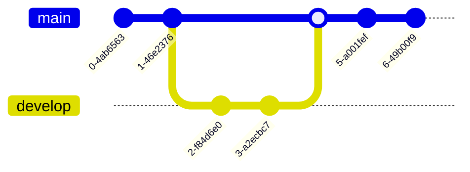

---
tags:
  - flag/MachineLanguage/Markup
  - Label/Industry-工业科学/IT/Language
---

## Brief

- Web
    - [Online FlowChart & Diagrams Editor - Mermaid Live Editor](https://mermaid.live/edit)

[Mermaid | Diagramming and charting tool](https://mermaid.js.org/)

[Diagram Syntax | Mermaid](https://mermaid.js.org/intro/n00b-syntaxReference.html)

- Idea
> [!cite] Mermaid 是一个基于 Javascript 的图表绘制工具，通过解析类 Markdown 的文本语法来实现图表的创建和动态修改。Mermaid 诞生的主要目的是让文档的更新能够及时跟上开发进度

- Test
    - 语法有点别扭，我更喜欢 [[PlantUML]]

- Supported Diagrams
    - [[饼图]]
    - [[思维导图]]
    - [[流程图]]
    - [[Gantt diagram]]
    - [[时序图]]
    - [[状态图]]
    - [[类图]]
    - [[C4 图]]
    - Git Graph
    - [[Journey 图]]

- Common Syntax
    - 要定义一个 Diagram（图表），首先要声明 Diagram Type（图表类型）

- Limitation
    - > [!suggest]
      > 我想放弃了…
      > 复杂的图画不了一点
      > 比如黑暗之魂的 [地图](https://www.gamersky.com/handbook/201805/1053927_2.shtml)
      > 

- Description
    - Mermaid 是一门 DSL
    - Mermaid 是一个 [JS 库](https://github.com/mermaid-js/mermaid)
    - DSL 与 JS 库的关系，类比 Python Specification 与 CPython，JS 库就是 DSL 的解析器、渲染器
    - Mermaid DSL 被设计为类 [[Markdown]] 的文本语法，充分吸收了 Markdown 的包裹式语法，可读性强，容易上手
    - Mermaid 基本已成为 Markdown 的事实标准，大部分 Markdown 编辑器和解析库采用 Mermaid 来实现 UML 绘图
    - [Mermaid Live Editor](https://mermaid.live) 是官方提供的在线编辑器，提供了交互式的体验与各种图表的示例

## 饼图 `pie`

- 使用关键字 `pie` 声明一个 [[饼图]]

## 思维导图 `mindmap`

- 使用关键字 `mindmap` 声明一个 [[思维导图]]

## 时间线 `timeline`

## 流程图 `flowchart` `graph`

[Flowcharts Syntax | Mermaid](https://mermaid.js.org/syntax/flowchart.html)

- 使用关键字 `flowchart` 或 `graph` 声明一个 [[流程图]]

## 甘特图 `gantt`

## 时序图 `sequenceDiagram`

## 状态图 `stateDiagram-v2`

## 类图 `classDiagram`

## Requirement Graph `requirementDiagram`

## C4 Graph `C4Context`

## ER Graph `erDiagram`

- Entity Relationship Diagrams 实体关系图
- 没错，就是后端程序员再熟悉不过的 Entity/Entry/Model/Schema，可以用来描述数据库条目

## Git Graph `gitGraph`

## Journey Graph `jouney`

- User Journey Diagram 用户体验旅程图
- 有点鸡肋，用不上
