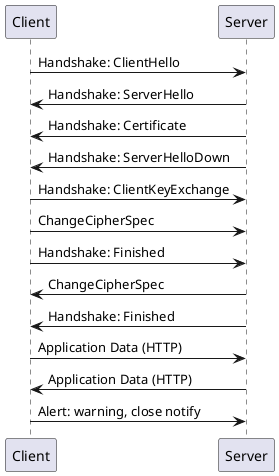

---
tags:
  - flag/MachineLanguage/Markup
  - Label/Industry-工业科学/IT/Language
---

## Brief

- References
    - [PlantUML](https://plantuml.com/)

- Installation
    - [PlantText UML Editor](https://www.planttext.com/)

- Users
    - [[Kroki]]

- Objects
    - Note
        - [[PlantUML]] 的各种 diagrams 基本都支持在图里添加 Notes（笔记/批注/便签）

但比较头疼的是，对于很多 markdown 编辑器并没有原生对其进行支持。

PlantUML 可以看作是著名绘图工具Graphviz 的封装。相比于Graphviz 的Geek 风，PlantUML 的颜值更高。而与Mermaid.js 相比，其支持的图形种类更为多样。

支持快速绘制：

    时序图：例如 HTTPS 通信步骤
    用例图
    类图
    活动图
    组件图
    状态图
    对象图
    部署图
    定时图

同时还支持以下非UML图:

    线框图形界面
    架构图
    规范和描述语言 (SDL)
    Ditaa diagram
    甘特图
    思维导图
    Work Breakdown Structure diagram
    以 AsciiMath 或 JLaTeXMath 符号的数学公式
    Entity Relationship diagram

时序图

例子：

在UML建模中，时序图中包括的建模元素主要有：

    对象（Actor）、
    生命线（Lifeline）、
    控制焦点（Focus of control）、
    消息（Message）等。

plantuml 使用如下关键字actor, boundary, control, entity, database声明参与者：

    @startuml
    actor actor
    boundary boundary
    control control
    entity entity
    database database
    @enduml
