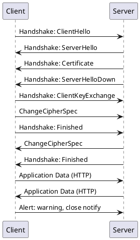

---
tags:
- Label/Article/Industry-工业科学/IT/LANGUAGE
---

# 密码学

参考

[小灰漫画解读：什么是AES算法](https://zhuanlan.zhihu.com/p/45155135)

[AES加密简单介绍](https://www.liankexing.com/notetwo/10134)

[循序渐进学加密](https://www.fengerzh.com/encryption/)

[PGP验证数字签名原理_实践求真知-CSDN博客](https://blog.csdn.net/chengqiuming/article/details/83047636)

[PGP生成数字签名并加密_实践求真知-CSDN博客](https://blog.csdn.net/chengqiuming/article/details/83048169)

[学习信息安全的网站](https://www.jianshu.com/p/5dcdc644f077)

[开源GPU密码破解工具–HashCat – ArkTeam](http://www.arkteam.net/?p=3737)

[浅谈常见的七种加密算法及实现 - 掘金](https://juejin.im/post/5b48b0d7e51d4519962ea383#heading-19)

## 算法最低标准

哈希算法：SHA-256
对称加密算法：AES128-CTR/CBC/GCM/CCM/Plly1305、ChaCha20
非对称加密算法：RSA2048
CA 黑名单：CRL、OCSP
如果单纯从密码学上讲，要实现与AES256相当的加密强度，RSA加密算法长度要达到16384位，AES128 理论强度 37 个 0。

## 0. 序

1. **「用户名」** 用于**区分不同用户**
2. **「口令」** （密码）用于**证明是本人**
3. **「密钥对」** 用于**双重证明**和**加密通信**
4. **「证书」** 用于**传递公钥**等信息
5.  **「签名」** 用于**证明证书真实性**或**证明是本人**（软件发布）

## 1. 非对称加密

第一，讲讲非对称加密的出现逻辑，什么是「加密」就不科普了。按常理，本来只有 1、2，且通信用对称加密就够了。想想去银行，只要有银行卡（用户名）和密码就行。但是由于网络是远程通信，中途变数太多，此时对称加密安全性就不够了，为了弥补安全性，有人想出了个办法，就是 **「非对称加密」**。所谓非对称加密，就是**使用了「密钥对」**。有了密钥对，安全需求即「加密」通信基本满足。注意，是基本，「中间人攻击」就很难辨别。为了进一步完善这个系统，**「数字证书」** 和 CA （颁发数字证书的权威机构）就诞生了。数字证书是和密钥紧密关联的，或者说它就是「保护」密钥的。但数字证书本身安全性就不够，需要保护，所以 **「数字签名」** 就诞生了。那数字签名不需要其他保护吗？是的，不需要。让我们看回去，密钥本身特性 + 证书保护，密钥不需要担心了；数字证书内容就包括密钥，数字签名基于「数字证书 + 密钥」生成，而数字签名又反回去「保护」证书，所以密钥、数字证书、数字签名**形成闭环，无懈可击**。

第二，讲讲非对称加密的本质「密钥」。密钥一定是一对的，所以「密钥」和「密钥对」没什么不同，单独叫公钥、私钥。他们之所以是密钥，是因为他们的特点是，**不管用哪个来加密，只要用另一个来解密就行**（所以才能「认证」）；**「公钥」加密的内容不能用公钥解密**（所以才能「加密」）；**「公钥」可用「私钥」算出来的**。「私钥」由于单方面持有，能做很多别人做不了的事，故能证明身份，即「认证」，或是「签名」。关于非对称加密の原理，**以上这些多够用了！** 不要再试图理解什么比喻或添加什么「正确的」东西了，除非你想让大脑变得混乱。

第三，讲讲「非对称加密」或者说 **「密钥」的具体实现**。**「SSL/TLS」** 就是非对称加密的具体应用方案，它又被应用为 SFTP、HTTPS 等。SSL单向认证只要求服务器部署了SSL证书就行，任何用户都可以去访问（IP被限制除外等），只是服务器提供了身份认证。SSL双向认证则是需要服务端与客户端提供身份认证，只能是服务端允许的客户去访问，安全性相对高一些。一般Web应用都是采用SSL单向认证的，原因很简单，用户数目广泛，且无需在通讯层对用户身份进行验证。密钥认证。**「密钥认证」** 是不采用密码登录，单纯采用 RSA 密钥对的认证方案，私钥自己持有，公钥要上传到服务器，比密码安全，风险在「私钥保密」与「公钥分发」，可以对私钥设置「口令」来加密私钥。

总结：没啥好总结，一定要把第二点弄懂。

## 2. SSH 认证全解析

SSH 安全隐患有「通信建立」与「暴力登录」。SSH **通信风险**有 2 个，**一是**客户端第一次向服务端发起通信时是明文，**无法保证接收的公钥就是服务器的公钥**，即「中间人攻击」的「冒充风险」，中间人有点像黑心 VPN，你和中间人用虚假的公钥通信，通信无异于明文，中间人假装成你，用正确的公钥与服务器通信，这会导致「明文通信」的另外 2 个风险：窃听风险、篡改风险。如果一定要用密码登录，**没什么好的解决办法**（因为没有 CA，无法防范），或许可以手动确认服务器公钥。**二是**将自己的**正确的公钥上传加入到服务器**的授权列表，这么做是为了达到双向认证，**成功了就不怕中间人了**。**暴力登录**风险有暴力破解密码和窃取私钥，前者通过换端口、加限制可以解决，后者可以设私钥口令解决。

另外，讲讲基本不用担心的「窃听风险（eavesdropping）」和「篡改风险（tampering）」。前者用非对称加密解决，后者有设像证书一样的校验机制，不用专门设置。所以，最后还是绕回了「密钥」，**保证服务器或自己的公钥是正确的，这才是最重要的！**

**总结**：配合 CA 的非对称加密很完美，没有 CA 的有冒充风险从而导致全局崩溃。密钥认证基本完美。不仅仅限于 SSH，任何采用非对称加密且没有 CA 的都是这样。最重要的是保证公钥正确。

## 3. 密钥格式

PEM(PKCS#8)：**pem** 是最常用的私钥和证书存储格式。其中通常会包含 ‘—–BEGIN XXXX—–” and “—–END XXXX—–” 字符串，中间存放了 **Base64** 编码过的二进制数据。多个PEM证书或私钥可以包含在一个文件中，但最好还是将各个证书和私钥分开存放。扩展名可能为.pem, .crt, .cer, .key。

PKCS#8定义了私钥信息语法和加密私钥语法，X509定义证书规范，密钥通常使用DER和PEM进行编码存储，Java中JCE使用的是DER。openssl主要用的是PEM编码。PEM相对DER可读性更强，以BASE64编码，外围包上类似----BEGIN RSA PRIVATE KEY----。 JCE没有对PEM直接支持，但是第三方那个包如bouncycastle可以解析。

 很多 SSH 公钥是**openssh 公钥**格式。其内容为ssh-rsa打头，RSA-1024结尾，中间是Base64编码:

    ssh-rsa XXXXXXXXXXXXXXXXXXXXXXXXXXXXXXXX== 注释

## 4. 对称加密

**算法效率对比**（由快到慢，MD4 最快）：MD4、MD5、CRC32、SHA1、SHA256、SHA512

我一直以为，对称加密，就是将「明文 P」与「密钥 K」，用「加密算法 E」进行运算，得出「密文 C」。即密文 C = E(P, K)。

解密时，将「密文 C」和「密钥 K」，用「解密算法 D」进行运算，得出「明文 P」。即 P = D(C, K)。

因为只有自己才懂得「密钥 K」所以才安全。但这样明显能暴力破解，也就是代入各种 K 去算，直到对为止。那么密钥 K = 123456 的话，分分钟破解就和明文无异了。

所以，不仅「密钥 K」 不能让别人知道，连「解密算法 D 」也是。

但文件在互联网上传播，对方不知道「解密算法 D」，那你告诉对方「密钥 K」也没用啊，但也从没见过有人连算法都要一齐说出来的。这就好比，你创建了一个 AES 加密的（密钥）压缩文件（密文），对方用 WinRAR 软件（解密算法）进行解压。这不你也没告诉别人解密算法么，那人只用解压密码（密钥）就可以得到明文。那么，AES 等对称加密算法为什么又不怕暴力破解了呢？只有这点我实在想不通......现在想通了，其实加密算法就是怕暴力破解，所以才要复杂密码。

不管是 AES 128、192、256，只要你在软件里设置了 123456 为密码，别人就能用 123456 解密，AES 加密意义何在呢？往大了的想，所有的「本地文件加密软件」意义何在呢？对称加密的作用在哪？

> 在古典加密算法当中，加密算法和密钥都是不能公开的，一旦泄露就有被破解的风险，我们可以用词频推算等方法获知明文。1972年美国IBM公司研制的DES算法(Data Encryption Standard)是人类历史上第一个**公开加密算法但不公开密钥**的加密方法，后来成为美国军方和政府机构的标准加密算法。2002年升级成为AES算法(Advanced Encryption Standard)

所以我实在搞不懂，放着私有加密算法不用，反而用「AES」这种公开算法，那不是叫人来穷举破解用户密钥吗？

后来想了想，AES 设计理念应该是「破解密文，只能直接穷举 128 位的密钥，而不能间接推算出密钥」，所以才要设计这么一套复杂的算法，让你看不出数据特征来。就是说，安全性全在密钥上而不是技术上。当然，软件漏洞、内存漏洞、天线漏洞等不包括在内。这大概就是 AES 被作为政府加密标准的原因吧。

## 5. Zero-knowledge Encrypt

**零知识加密**（Zero-knowledge Encrypt）目前有 2 个比较广泛的应用：区块链与数据安全托管服务，尤其是后者。

「数据安全托管服务」是我生造的一个词，意思是用户将自己的数据加密并托管给服务商，之后只需提供密码即可取回数据并完成解密，整个过程只有用户自己有办法解密数据。

例如 Mega 云盘便提供加密云端存储服务，并靠着无法感知数据内容这点，摆脱了所谓的美国法律的束缚，成为最受欢迎的网盘之一。

核心原理其实很简单，只需将密码 P 作为参数分别代入 2 个不同的不可逆函数，1 个函数值作为用户的登录凭证，1 个函数值用来对文件加密。

最简单的实现就是将密码代入 SHA256 MD5 散列函数，MD5 当作用户的密码，SHA256 作为 AES-256 的密钥。这样服务商知道 MD5，却无法还原出密码，也就无法知道 SHA256，自然不能解密数据。

不过这种方法过于简陋，如果用户需要更换密码呢？如果用户要求每次加密都用不同的密钥呢？你可能会想到非对称加密的管理方式，想 GPG 那样，用主密钥对生成多个子密钥与撤销密钥，这样就能满足「改密码」「每次使用不同密钥」了。但主密钥如何保存呢？单靠口令（密码）吗，那服务商岂不是能暴力破解了？让用户保存吗？用户又记不住这么长的密码......

总之，虽然设计一整套管理系统是一件很复杂的事，但究其原理其实很简单，抽象地说就是用 1 个参数代入了 2 个单向函数。至于其他功能，都是根据用户需求要求一项做一项罢了。

以上皆为个人的胡思乱想，没有任何事实数据支撑。

## 6. 数字证书

SSL 证书（CA 负责管理）
自签名证书（debug）
GPG 证书（主签名，4096，口令）
SSH 密钥（主登陆，4096，口令）

密码学上，GPG 与 X.509 没有任何区别，你使用同一对密钥都行。它们真正的区别在于格式的不同，附加说明的不同，因此才会造成用途的分离，其实它们都可以胜任认证、签名、加密。就好比密钥是身份证号码，GPG 是身份证，X.509 是驾照，它们格式不同，但上面的身份证号相同。

不大推荐使用自签名证书，如同上面的比喻，密钥与证书就好比身份证号和身份证。要加密，密钥就够了。单独的自签名证书，估计只有在本地搭建测试环境时需要，对外认证已经有 CA 了，去中心化签名有 GPG，自签名证书就很鸡肋。

务必区分密钥对与证书这两个概念。粗暴地说，单纯的密钥对文本，是 OpenSSH；证书，则是 openSSL，多出了一堆名称、机构等信息。

## 7. SSL

HTTPS并非是应用层的一种新协议。只是HTTP通信接口部分用SSL（Secure Socket
Layer）和TLS（Transport Layer Security）协议代替而已。

通常，HTTP直接和TCP通信。当使用SSL时，则演变成先和SSL通信，再由SSL和TCP
通信了。

SSL是独立于HTTP的协议，所以不光是HTTP协议，其他运行在应用层的SMTP和
Telnet等协议均可配合SSL协议使用。可以说SSL是当今世界上应用最为广泛的网络
安全技术。

SSL 的三次握手完成后，之后就是单纯的 HTTP 流量，跟平常不使用 SSL 的 HTTP 流量没有任何区别！没有区别！没区别！

按照现在的网络环境，绝对不会使用明文，所以密钥协商是建立 HTTP 连接的不可或缺的步骤。密钥协商只有 2 种方式，明文与 SSL。无论是用哪种，之后的 HTTP 请求与响应的数据包都是一模一样的（假设明文与 SSL 协商出来的是同一个密钥），一比特都不会差。

## SSL 证书

[SSL 证书的类型 | SSL 证书类型介绍 | Cloudflare](https://www.cloudflare.com/zh-cn/learning/ssl/types-of-ssl-certificates/)

单域名 SSL 证书：字面意思。只能匹配该域名，不能匹配子域名。

通配符 SSL 证书（SAN 证书）：`*.xxx.com`

多域名 SSL 证书（MDC 证书）：可以跨域名，例如 `a.com` `b.com` `c.com`。

组合：实测使用 acme.sh 申请 Let's Encrypt 证书，同时可以「多域名」+「跨域名」+「泛域名」，例如 `a.com` `*.a.com` `b.com` `*.b.com` `c.com` `blog.c.com` `*.blog.c.com` `www.c.com` 可以用一张证书解决。

## CA

[密码学系列之:在线证书状态协议OCSP详解 - 知乎](https://zhuanlan.zhihu.com/p/538429402)

## 量子密钥分发

「量子加密」主要被运用于「更安全的密钥交换」，也就是用来代替「非对称加密」，现在的密钥交换主要通过基于非对称加密的 TLS/SSL 实现。

中国在这方面处于时代前沿，据说已经在国内建成了几条量子线路了。

「BBM92 协议」就是其中一种量子加密协议。

1. 制作纠缠粒子（光子）对
2. 这对光子分别发射给两个基站
3. 量子加密的安全性来源于量子的不可复制性。如果发给基站的过程中光子被拦截了，中间人确实会知道密钥，但由于不可复制性，无法伪造出一模一样的光子发送给基站，之后一比对，基站就知道接收的信息是假的了，于是抛弃
3. 基站根据接收到的信息创建密钥
4. 用汉明码 etc. 方式进行密钥纠错，比对密钥，双方得到完全相同的密钥，确保双方接收到的信息来源于同一纠缠粒子对，没被拦截
5. 使用密钥进行通信

## End-to-End

[端到端与点到点的联系与区别 - 个实离 - 博客园](https://www.cnblogs.com/beyond_dxb/p/8304093.html)

[什么是点对点通信？](https://www.star-elink.com/news/1997.html)

端到端，其实是个伪概念，是句废话。OSI 本来的目的就是下层协议为上层协议提供一条龙的传输服务。哪个连接不是端到端？端到端可以说是 OSI 的基本特性。

端到端加密，其实跟端到端没什么关系。真正想强调的是，通信双方无法被中间人攻击。C/S 下这点很好实现，一个 https 就搞定了。但 SMS 之类的，通讯双方都是「客户端」，难度就很高。与客户端相对的就是中继服务器。

普通的 C/S 模型，应该是由中继提供服务。而端到端模型，中继被视为中间人，是不可信的存在。

我能想到的端到端加密方案，或者说，端到端密钥交换方案。

客户端生成密钥对，公钥明文上传到中继服务器的某个账号，私钥零知识加密上传到中继服务器。

本质上，端到端加密就是零知识加密的另一种应用。零知识加密才是最核心的。

无论名字起出花来，最关键的仍然是密钥交换，而且还是非对称加密的密钥交换。你可以理解为中继不仅当 CA，还当 mega 云盘来存储私钥

## 无条件安全

穷举219位密钥就要耗尽宇宙的已知能量——《应用密码学》
