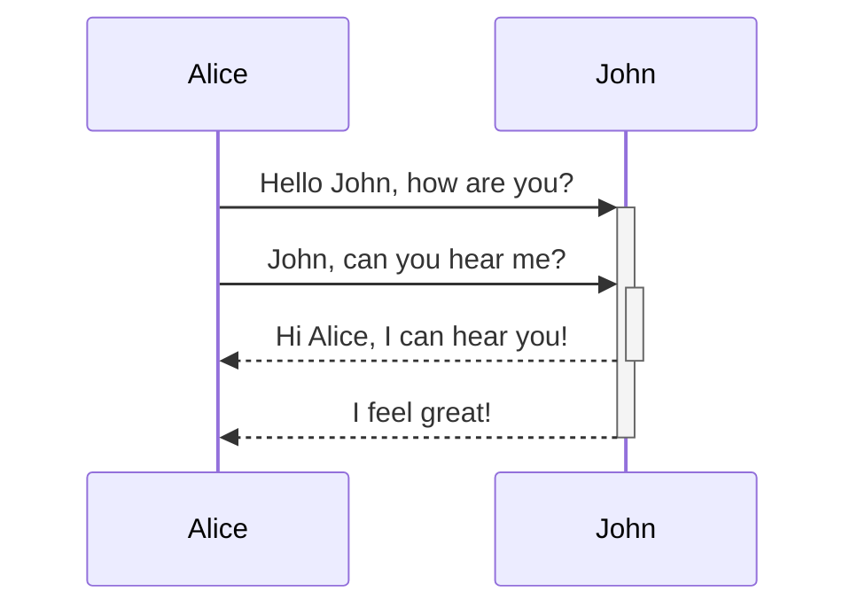

Kroki provides a unified API with support for BlockDiag (BlockDiag, SeqDiag, ActDiag, NwDiag, PacketDiag, RackDiag), BPMN, Bytefield, C4 (with PlantUML), D2, DBML, Ditaa, Erd, Excalidraw, GraphViz, Mermaid, Nomnoml, Pikchr, PlantUML, Structurizr, SvgBob, Symbolator, TikZ, UMLet, Vega, Vega-Lite, WaveDrom, WireViz... and more!

This feature allows you to add diagrams and charts in different languages to your note.

## Syntax

````

````

````
```kroki type=mermaid
sequenceDiagram
    Alice->>+John: Hello John, how are you?
    Alice->>+John: John, can you hear me?
    John-->>-Alice: Hi Alice, I can hear you!
    John-->>-Alice: I feel great!
```
````

````
```plantuml
skinparam ranksep 20
skinparam dpi 125
skinparam packageTitleAlignment left

rectangle "Main" {
  (main.view)
  (singleton)
}
rectangle "Base" {
  (base.component)
  (component)
  (model)
}
rectangle "<b>main.ts</b>" as main_ts

(component) ..> (base.component)
main_ts ==> (main.view)
(main.view) --> (component)
(main.view) ...> (singleton)
(singleton) ---> (model)
```
````
